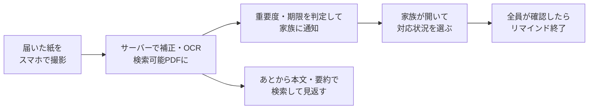
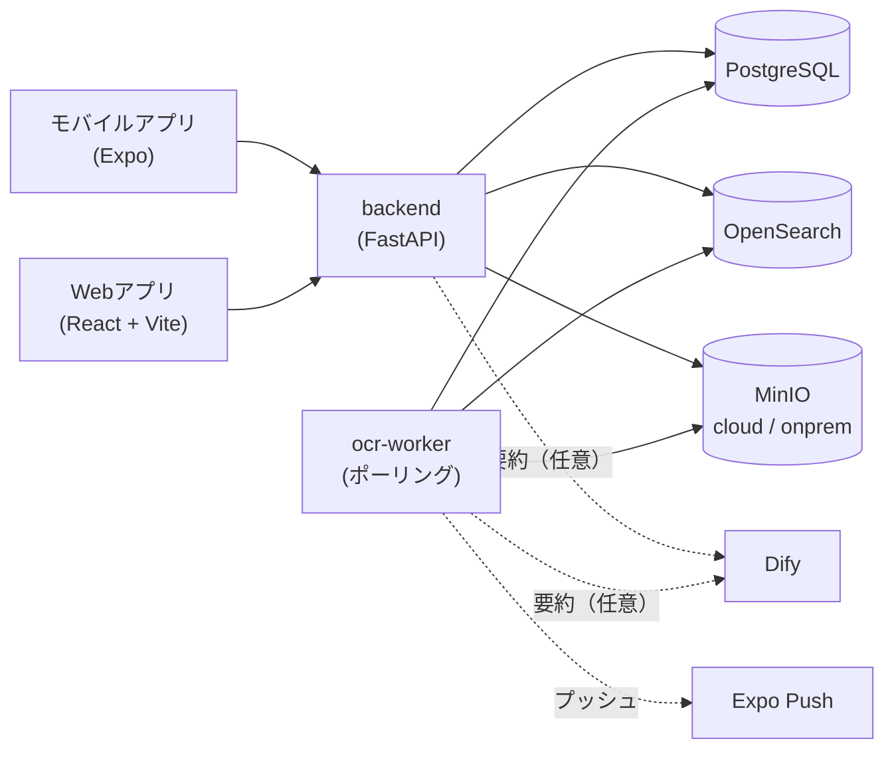

# 紙ログ

> **届いた紙を、撮って、探せて、家族で見逃さない。**

スマートフォンで紙の資料を撮影すると、補正・OCR を経て**検索できる電子ドキュメント**として保存される。OCR した本文から**重要度と期限**を判定して家族に知らせ、誰が確認したかを共有する。全員が確認したらリマインドは止まる。利用する世帯・組織ごとに**テナント**でデータを分け、公開デモと実利用を混ぜない。

> **紙ログ** は本システムの呼称です（旧称: 紙媒体電子管理システム）。
> リポジトリ名・パッケージ名（`dms-web` / `dms-mobile`）・Docker サービス名などの識別子は変更していません。

## コンセプト

学校のプリント、請求書、役所の通知といった紙は、受け取った人しか中身を知らず、しまい込むと探せなくなる。期限のある紙ほど、家族の誰かが見逃すと困る。

紙ログは、**紙を「撮るだけ」で検索できる電子データにし、その中身から家族に知らせる**ことで、この問題をなくす。

| 考え方 | 内容 |
|---|---|
| 撮るだけで、探せる紙に | 撮影した画像はサーバーで輪郭検出・台形補正・画質補正され、OCR で検索可能 PDF になる。紙を手放しても、本文や要約で探せる |
| 大事な紙を、見逃さない | OCR 本文から重要度・期限・対象を判定し、登録した人以外の家族に知らせる |
| 誰が見たかを、共有する | 家族それぞれの既読と対応状況（確認した / 対応する / 対応済み / あとで確認）を並べて表示する。全員が確認したらリマインドを止める |
| 中身は、外に出さない | 解析はルールベースで、本文を外部サービスに送らない。プッシュ通知の本文にも書類の中身を載せない。機密の書類はオンプレミス側に保存する |
| 家族ごとに、閉じる | ユーザー・グループ・書類・通知はテナントの中に閉じる。公開デモのアカウントから実利用の書類は見えない |

| 項目 | 内容 |
|---|---|
| ステータス | **フェーズ1〜4（認証・撮影・OCR・検索）、フェーズ9（家族での共有・通知）、フェーズ10（テナント分離）の主要機能を実装済み**（[開発ロードマップ](#14-開発ロードマップ)） |
| 公開デモ | https://document.makoto-kamimura.com （デモ用アカウントの案内はポートフォリオ側に掲載） |
| 作成者 | **Makoto Kamimura** — [@makoto-kamimura](https://github.com/makoto-kamimura) |

このREADMEは、プロジェクト紹介と仕様書を兼ね、次の2部と付録で構成する。

| 部 | 内容 | 主な読者 |
|---|---|---|
| [第1部 概要説明](#第1部-概要説明) | 目的、機能と画面の仕様、要件ごとの実装状況、ロードマップ | すべての人 |
| [第2部 技術説明](#第2部-技術説明) | 技術スタック、システム構成、クイックスタート、実装方針、データモデル、API、非機能要件 | 開発者 |
| [付録](#付録) | 決定事項、未決事項 | すべての人 |

設計・計画の資料、運用手順書、タスク一覧は [docs/](docs/README.md) に種類ごとに置く。

## 目次

- [コンセプト](#コンセプト)
- [第1部 概要説明](#第1部-概要説明)
  - [特徴](#特徴) / [使い方のイメージ](#使い方のイメージ)
  - [1. 概要](#1-概要) / [2. 用語](#2-用語) / [3. ユーザー種別と権限](#3-ユーザー種別と権限) / [4. 基本フロー](#4-基本フロー) / [5. 画面一覧](#5-画面一覧) / [6. 認証とアカウント](#6-認証とアカウント)
  - [7. 撮影と取り込み](#7-撮影と取り込み) / [8. ドキュメント化とOCRと保存](#8-ドキュメント化とocrと保存) / [9. 閲覧と検索](#9-閲覧と検索) / [10. 閲覧記録](#10-閲覧記録)
  - [11. 家族での共有と通知](#11-家族での共有と通知) / [12. テナント分離](#12-テナント分離) / [13. 管理機能](#13-管理機能) / [14. 開発ロードマップ](#14-開発ロードマップ)
- [第2部 技術説明](#第2部-技術説明)
  - [15. 技術スタックとシステム構成](#15-技術スタックとシステム構成)（[クイックスタート](#156-クイックスタート)を含む）
  - [16. 認証の実装](#16-認証の実装) / [17. 機能ごとの実装方針](#17-機能ごとの実装方針) / [18. データモデル](#18-データモデル) / [19. API](#19-api) / [20. 非機能要件](#20-非機能要件)
- [付録](#付録)
  - [21. 決定事項](#21-決定事項) / [22. 未決事項](#22-未決事項)

---

# 第1部 概要説明

サービスの目的・機能・画面の仕様をまとめる。技術的な内容は[第2部](#第2部-技術説明)に分ける。要件ID（F-01〜F-41）は初期の[要件定義書](docs/design/requirements.md)に準拠する。

## 特徴

| 特徴 | 内容 |
|---|---|
| 撮影と自動補正 | 複数ページを連続撮影して1つのドキュメントにまとめる。輪郭検出・台形補正・明るさ補正・カラー / グレー / 白黒の切り替えはサーバーで行う |
| 画質チェック | ブレ・暗さ・影ムラ・解像度を判定し、低品質なら警告する |
| 検索可能 PDF | OCR のテキスト層を埋め込んだ PDF を自動で作り、保存する。日本語の縦書きにも対応する |
| 全文検索 | タイトル・OCR 本文・要約・タグを横断して検索する。表記ゆれにはあいまい一致で対応し、該当箇所をハイライトする |
| 要約と要約 PDF | OCR 本文を要約し、検索の対象にする。要約や OCR 全文を PDF にして共有できる |
| 家族への通知 | 重要度・期限を判定して家族に知らせ、未確認の人にだけリマインドする。期限の前日にも知らせる |
| 対応状況とコメント | 家族それぞれの既読・対応状況を1画面で見られる。コメントで申し送りができる |
| 権限と共有 | 4段階のロール、ドキュメント単位の権限（閲覧 / 編集 / 削除）、同じグループのメンバーへの自動共有 |
| バージョン管理 | 差し替えると前の版を履歴に残し、再度 OCR する |
| ハイブリッド保存 | 機密度が「機密」の書類はオンプレミス側、それ以外はクラウド側のストレージに保存する |
| テナント分離 | デモと実利用、世帯・組織ごとにデータを分ける |

## 使い方のイメージ



## 1. 概要

### 1.1 ポジショニング

紙を電子化するスキャナーアプリと、家族の連絡を共有するアプリの中間に位置付ける。電子化した紙の**中身**をきっかけに、家族へ知らせて確認を集めるところまでを1つのアプリで行う。

当初は業務用の「紙媒体資料の撮影・電子保存・閲覧管理システム」として[要件定義](docs/design/requirements.md)した。撮影・OCR・検索・権限・閲覧記録の要件はそのまま引き継ぎ、家庭での利用（家族での共有・通知）とテナント分離を加えている。

### 1.2 原則

- **撮るのは一度だけ**：補正・OCR・要約・解析・通知は、撮影後にサーバーが自動で行う。
- **本文を外に出さない**：文書解析はルールベースで行い、プッシュ通知には定型文だけを載せる。
- **見えてはいけないものは存在ごと伏せる**：別テナントや権限のないドキュメントには 404 を返す。

### 1.3 想定ユースケース

- 学校のプリントを撮って、提出期限を家族全員に知らせる。
- 請求書・役所の通知を撮って、支払いや手続きの担当と完了を共有する。
- 保管している紙を電子化して、後から本文で探す。

## 2. 用語

| 用語 | 意味 |
|---|---|
| ドキュメント | 撮影またはアップロードした1件の資料。複数ページを持てる |
| テナント | データ分離の最上位の単位（世帯・組織）。デモ用（`demo`）と実利用（`family`）を起動時に作る |
| グループ | テナントの中のユーザーの集まり。家族の単位として使う。同じグループのメンバーは、互いのドキュメントを自動で閲覧できる |
| 家族 | あるドキュメントについて、所有者と同じグループのメンバー＋個別に共有されたユーザー（所有者を含む） |
| 機密度 | `public` / `internal` / `confidential`。`confidential` はオンプレミス側に保存する |
| OCR ステータス | `pending`（待ち）→ `processing`（処理中）→ `done`（完了）/ `failed`（失敗） |
| 解析結果（インサイト） | OCR 本文から判定した重要度・期限・行事日・対象・キーワード・判定理由 |
| 対応状況 | 家族それぞれが選ぶ「確認した / 対応する / 対応済み / あとで確認」 |
| 確認済み | ドキュメントを開いた（既読）か、「確認した / 対応する / 対応済み」を選んだ状態。「あとで確認」は未確認として扱う |
| 権限レベル | ドキュメント単位の `view`（閲覧）< `edit`（編集）< `delete`（削除） |

## 3. ユーザー種別と権限

### 3.1 ロール

| ロール | 範囲 | できること |
|---|---|---|
| 全体管理者（`super_admin`） | 全テナント（テナントに属さない） | テナントの作成・変更・削除、操作対象テナントの切り替え、ユーザーのテナント移動。**非公開**で、既定では作成しない（[6.2節](#62-全体管理者)） |
| 管理者（`admin`） | 自テナント | テナント内の全ドキュメントへのフル権限、ユーザー・グループの管理、閲覧履歴の照会 |
| 登録者（`registrar`） | 自テナント | 撮影・登録、自分のドキュメントの編集、共有されたドキュメントの閲覧 |
| 閲覧者（`viewer`） | 自テナント | 共有されたドキュメントの閲覧。アップロードは現在 API で制限していない（[Q10](#22-未決事項)） |

### 3.2 ドキュメントへのアクセス判定

上から順に判定する。

1. 別テナントのドキュメントは、所有者・権限・ロールに関係なくアクセスできない（404）。
2. 全体管理者、同じテナントの管理者、所有者は、常にフル権限を持つ。
3. 個別に付与された権限（`view` / `edit` / `delete`）があれば、そのレベルまで操作できる。
4. 閲覧だけは、所有者と同じグループに属していれば許可する（グループ自動共有）。

## 4. 基本フロー

### 4.1 撮影から保存まで

1. モバイルアプリで撮影する（複数ページ可）。ライブラリの画像や PDF も取り込める。オフライン時は端末に退避し、再接続時に自動で送る。
2. サーバーがドキュメントを `pending` で登録する。
3. OCR ワーカーが、ページごとに輪郭検出・台形補正・画質補正・モード変換を行い、品質を判定する。
4. ページをまとめて OCR し、検索可能 PDF を作る。本文・要約をストレージと検索索引に保存する。
5. 本文を解析し、重要度・期限などを保存して家族に通知する（[4.2節](#42-家族への通知)）。

### 4.2 家族への通知

1. OCR の完了後、本文から重要度・期限・行事日・対象・キーワード・分類を判定する。自動で付いたタイトル（`資料_123` など）は見出しの候補に、空のカテゴリは推定した分類に置き換える。
2. 登録者以外の家族に通知する（1書類につき1回）。
3. 家族は書類を開くか、対応状況を選ぶ。
4. 未確認の家族には一定の間隔でリマインドする。**全員が確認したら止める**。期限の前日には期限の通知を送る。
5. 家族の誰でも「もう一度通知」で未確認の人に知らせられる。コメントを付けると他の家族に知らせる。

### 4.3 検索から閲覧まで

1. 全文検索する（カテゴリ・書類種別・タグで絞り込める）。
2. テナントと閲覧権限で絞られた結果が、ハイライト付きで返る。
3. 結果のサムネイルやタイトルから、ページめくりビューアを開く。
4. 権限に応じてダウンロード・印刷する。閲覧・ダウンロード・印刷は記録される。

## 5. 画面一覧

### 5.1 Web

| 画面 | パス | 対象 | 内容 |
|---|---|---|---|
| ログイン | `/login` | すべて | メールアドレスとパスワードでログイン |
| ドキュメント一覧 | `/documents` | すべて | 一覧 / サムネイル表示、メタデータ・タグ・OCR テキストの編集、ビューア（ページ送り・ズーム・印刷）、バージョン履歴と差し替え、ドキュメント単位の権限、家族の確認状況 |
| 全文検索 | `/search` | すべて | 横断検索、ハイライト、結果からビューアを起動 |
| お知らせ | `/notifications` | すべて | 通知の一覧、既読化、すべて既読 |
| ユーザー管理 | `/users` | 管理者 | ユーザーの作成・ロール変更・パスワード再設定・削除 |
| グループ管理 | `/groups` | 管理者 | グループとメンバーの管理 |
| テナント管理 | `/tenants` | 全体管理者 | テナントの作成・変更・削除、操作対象の切り替え |

全体管理者には、サイドバーの下部に操作対象テナントの切り替えが表示される。

### 5.2 モバイルアプリ

| 画面 | 内容 |
|---|---|
| ログイン | メールアドレスとパスワードでログイン |
| ドキュメント一覧 | 区分（すべて / 未読 / 🔴重要 / 📅期限あり / 既読）、重要度・期限・家族の確認人数の表示 |
| 撮影 | 連続撮影、カラー / グレー / 白黒の切り替え、プレビュー・並べ替え・削除、画像 / PDF の取り込み、オフライン時の退避と再送 |
| ドキュメント詳細 | 複数ページのページ送り、画質の警告、家族の確認状況・対応状況・コメント・もう一度通知、検索可能 PDF / OCR 全文 PDF / 要約 PDF の保存と共有 |
| 検索 | 全文検索 |
| お知らせ | 通知の一覧（未読バッジ） |

## 6. 認証とアカウント

### 6.1 ログイン

メールアドレスとパスワードで認証する（F-33）。多要素認証・SSO（F-34）は未対応。

### 6.2 全体管理者

全体管理者は**既定では作成しない**。運用者の既存アカウントを DB で昇格させ、テナントの所属を外す（手順は[運用手順書](docs/runbooks/operation.md)）。`SEED_SUPER_ADMIN_EMAIL` を指定した場合だけ初回起動時に作成し、パスワードが未設定なら起動ログに1度だけ表示する。

### 6.3 初期アカウント

| テナント | アカウント | ロール | 公開 |
|---|---|---|---|
| `demo`（デモ） | `demo@example.com` | 管理者 | **公開** |
| `demo` | `demo-registrar@example.com` | 登録者 | **公開** |
| `demo` | `demo-viewer@example.com` | 閲覧者 | **公開** |
| `family`（実利用） | `SEED_ADMIN_EMAIL`（既定 `admin@example.com`） | 管理者 | 非公開 |

- デモの3アカウントは同じグループ「デモ家族」に入り、ロールごとの見え方を試せる。アカウントの案内はポートフォリオ側に載せ、ログイン画面には出さない。
- 実利用を始めるときは、実利用テナントの管理者のパスワードを必ず変更する。

## 7. 撮影と取り込み

| No. | 要件 | 区分 | 状態 | 仕様 |
|---|---|---|---|---|
| F-01 | 端末カメラでの撮影 | 必須 | 実装済み | expo-camera で撮影 |
| F-02 | 連続撮影と1ドキュメントへの統合 | 必須 | 実装済み | ページの配列を送り、サーバーで1つの PDF にまとめる |
| F-03 | 輪郭の自動検出とトリミング | 必須 | 実装済み | サーバーの OpenCV で輪郭を検出し、透視変換する（検出できなければ元の画像を使う） |
| F-04 | 傾き・台形の補正 | 必須 | 実装済み | 同上。OCR 時にも傾きと向きを補正する |
| F-05 | 明るさ・コントラスト・シャープネスの最適化 | 必須 | 実装済み | CLAHE とノイズ除去。シャープネスは簡易 |
| F-06 | カラー / グレー / 白黒の切り替え | 必須 | 実装済み | 撮影画面で選び、サーバーで変換する |
| F-07 | 影・映り込み・指写りの検出 | 推奨 | 一部 | 影ムラ・明るさの警告まで。指写りの検出と除去は未対応 |
| F-08 | プレビュー・再撮影・並べ替え・削除 | 必須 | 実装済み | サムネイル列で操作する |
| F-09 | 品質チェックと再撮影の促し | 推奨 | 実装済み | 端末で解像度、サーバーでブレ・明るさを判定する |
| F-10 | 既存の画像 / PDF の取り込み | 推奨 | 実装済み | ライブラリの画像・PDF を取り込む |
| F-11 | オフライン撮影と再接続時の同期 | 推奨 | 実装済み | 端末に退避し、復帰時に自動で再送する（手動の同期も可） |

## 8. ドキュメント化とOCRと保存

| No. | 要件 | 区分 | 状態 | 仕様 |
|---|---|---|---|---|
| F-12 | 複数ページを1つの PDF に | 必須 | 実装済み | img2pdf → ocrmypdf で1つの検索可能 PDF にする |
| F-13 | OCR によるテキスト抽出 | 必須 | 実装済み | 全ページを抽出し、NFKC 正規化と、日本語の間の余分な空白の除去を行う |
| F-14 | 検索可能 PDF の生成 | 必須 | 実装済み | 撮影後に自動で作ってストレージに保存する。OCR 全文 PDF・要約 PDF も出力できる |
| F-15 | 日本語（縦書き含む）・英数字の混在 | 必須 | 実装済み | `jpn+jpn_vert+eng`、高精度モデル tessdata_best |
| F-16 | OCR 結果の確認と手動修正 | 推奨 | 実装済み | Web の編集画面で修正すると、検索索引も更新する |
| F-17 | メタデータの付与 | 必須 | 実装済み | タイトル・カテゴリ・書類種別・タグ・機密度を編集できる |
| F-18 | フォルダ / カテゴリの階層管理 | 必須 | 対象外 | カテゴリとタグで代替する（[決定事項](#21-決定事項) D11） |
| F-19 | バージョン管理 | 推奨 | 実装済み | 差し替え時に現在の版を履歴に移し、版数を上げて再度 OCR する |
| F-20 | 機密度によるハイブリッド保存 | 必須 | 実装済み | `confidential` はオンプレ側、それ以外はクラウド側。機密度を変えると保存先を判定し直す |

## 9. 閲覧と検索

| No. | 要件 | 区分 | 状態 | 仕様 |
|---|---|---|---|---|
| F-21 | 一覧・サムネイル表示 | 必須 | 実装済み | Web・モバイルとも一覧とサムネイル。検索結果にもサムネイルを出す |
| F-22 | ページめくり・拡大縮小ビューア | 必須 | 実装済み | Web はページ送り・ズーム・印刷、モバイルはページ送り |
| F-23 | 全文検索 | 必須 | 実装済み | OCR 本文と要約が対象。あいまい一致で表記ゆれに対応する |
| F-24 | キーワード検索 | 必須 | 実装済み | タイトル・タグ・カテゴリが対象。タグは完全一致で絞り込める |
| F-25 | ハイライトと該当箇所 | 推奨 | 実装済み | 本文・要約・タイトルの一致箇所を返して表示する |
| F-26 | 絞り込み検索 | 必須 | 一部 | カテゴリ・書類種別・タグで絞り込める。日付・登録者は対象外 |
| F-27 | 権限に応じたダウンロード / 印刷 | 必須 | 実装済み | 閲覧権限を確認してから返す。印刷は記録する |

## 10. 閲覧記録

| No. | 要件 | 区分 | 状態 | 仕様 |
|---|---|---|---|---|
| F-28 | 閲覧ログの自動記録 | 必須 | 実装済み | ドキュメントを開くと `view` を記録する |
| F-29 | ダウンロード・印刷・編集・削除のログ | 必須 | 一部 | ダウンロード・印刷・編集（メタデータ変更・差し替え）を記録する。ドキュメントの削除は API がないため記録もない |
| F-30 | 閲覧履歴の照会 | 必須 | 一部 | 既読者の一覧と、管理者向けのログ照会 API。専用の画面は一部 |
| F-31 | ログの検索・CSV 出力 | 推奨 | 未着手 | |
| F-32 | 未読 / 既読の管理 | 任意 | 実装済み | 開くと既読になる。一覧に未読 / 既読を表示し、所有者と管理者は既読者を見られる |

監査ログの改ざん防止（追記専用・ハッシュ）は未対応（[22. 未決事項](#22-未決事項)）。

## 11. 家族での共有と通知

### 11.1 文書解析

OCR 本文から、次をルールベースで判定する。外部サービスに本文を送らない。

| 項目 | 内容 |
|---|---|
| 重要度 | `high` / `normal` / `low`。「重要」「至急」「督促」などで上げ、「セール」「キャンペーン」などの販促で下げる |
| 期限 | 「9月30日までに」「提出期限 令和8年9月30日」など。漢数字・和暦・OCR の空白混じりにも対応する |
| 行事日 | 「10月5日(日) 開催」など |
| 対象 | 「保護者の方へ」「山田太郎 様」など |
| キーワード・分類 | 提出・支払い・申込などの行動と、学校 / 行政 / 支払い・請求などの分類 |
| タイトル候補 | 自動で付いたタイトルを置き換える見出し |

解析結果は手動で直せる。直した後は自動の解析で上書きしない。

### 11.2 通知

| 種類 | 送るとき | 送る相手 |
|---|---|---|
| 新しい紙 | OCR と解析が終わったとき（1書類1回） | 登録者以外の家族 |
| リマインド | 重要または期限つきの書類で、前回から一定の時間が過ぎたとき（既定 24時間ごと、1人・1書類につき最大3回） | 未確認の家族 |
| 期限 | 期限の前日（既定）から1回 | 「対応する」を選んだ人。誰かが「対応済み」なら送らない。どちらもなければ家族全員 |
| もう一度通知 | 家族が押したとき（同じ相手へは5分空ける） | 指定した人、または未確認の全員 |
| コメント | コメントが付いたとき | 書いた人以外の家族 |

- 通知はアプリ内（一覧・未読バッジ）に届く。端末がプッシュ用のトークンを登録していれば、Expo のプッシュも送る。
- プッシュの本文は種類ごとの定型文だけにし、書類のタイトル・本文・期限は載せない。
- 全員が確認したら、リマインドは止まる。期限を過ぎた書類にはリマインドを送らない。

## 12. テナント分離

- ユーザー・グループ・ドキュメント・通知は、必ず1つのテナントに属する（全体管理者だけは属さない）。
- 一覧・検索・通知・ログは、すべてテナントで絞り込む。検索索引にもテナントを持たせる。
- 別テナントのリソースは、存在を伏せて 404 を返す。
- 全体管理者は、操作対象のテナントを切り替えられる。指定しなければ全テナントを横断する。作成系の操作ではテナントの指定が必要。
- ユーザーを別テナントに移すと、所有するドキュメントと通知も一緒に移り、移動で不整合になるグループ所属と個別の権限は解除される。
- テナントは、中身が空のときだけ削除できる。
- テナント導入前の既存データは、起動時に実利用テナント（`family`）へ移す。

設計の詳細は [docs/design/plan-tenants.md](docs/design/plan-tenants.md)。

## 13. 管理機能

| No. | 要件 | 区分 | 状態 | 仕様 |
|---|---|---|---|---|
| F-33 | ユーザー登録・認証 | 必須 | 実装済み | 管理者がユーザーを作る。ID / パスワードで認証する |
| F-34 | 多要素認証・SSO | 推奨 | 未着手 | |
| F-35 | ロール管理 | 必須 | 実装済み | 全体管理者 / 管理者 / 登録者 / 閲覧者 |
| F-35a | テナント単位のデータ分離 | 必須 | 実装済み | [12章](#12-テナント分離) |
| F-36 | ドキュメント / フォルダ単位の権限 | 必須 | 一部 | ドキュメント単位の権限とグループ自動共有。フォルダ単位は対象外 |
| F-37 | 操作範囲の制御 | 必須 | 一部 | `view` < `edit` < `delete` を定義し、閲覧・編集に適用済み。削除はドキュメント削除 API とあわせて適用する |
| F-38 | ユーザー・権限のマスタ管理 | 必須 | 実装済み | Web のユーザー管理・グループ管理・ドキュメント権限 |
| F-39 | カテゴリ / タグのマスタ管理 | 必須 | 対象外 | 自由入力のカテゴリとタグで運用する（D11） |
| F-40 | 利用状況の集計レポート | 推奨 | 未着手 | テナント単位のレポートとあわせて行う |
| F-41 | 保管期限と自動アーカイブ / 削除 | 推奨 | 未着手 | `retention_until` の列だけ用意している |

## 14. 開発ロードマップ

| フェーズ | 内容 | 状態 |
|---|---|---|
| 0 | 基盤・環境構築（Docker Compose、DB・検索・ストレージ） | 一部完了（CI/CD・インフラ・TLS は未着手） |
| 1 | 認証・ユーザー / 権限管理 | 完了（MFA / SSO を除く） |
| 2 | 撮影・取り込み | 完了（指写りの検出を除く） |
| 3 | ドキュメント化・OCR・保存 | 完了 |
| 4 | 閲覧・検索 | 完了 |
| 5 | 閲覧記録管理 | 一部完了 |
| 6 | 管理機能（レポート・保管期限） | 未着手 |
| 7 | 非機能・運用（暗号化・バックアップ・性能・対応環境） | 未着手 |
| 8 | 確定事項（性能目標・機密度区分・OCR エンジン・保持期間） | 未着手 |
| 9 | 家族での共有・通知 | 完了（プッシュの実機確認を除く） |
| 10 | テナント分離 | 完了（テナント単位のレポートを除く） |

タスクごとの状態は [docs/tasks/task.md](docs/tasks/task.md) にまとめる。

---

# 第2部 技術説明

## 15. 技術スタックとシステム構成

### 15.1 選定の方針

- 中核の OCR・画像処理を Python のエコシステム（OpenCV / Tesseract / ocrmypdf）で扱うため、バックエンドを Python にそろえる。
- 撮影後の補正は端末ではなくサーバーで行い、アプリを Expo の標準機能の範囲に収める。
- 全文検索は、ハイライトと日本語の形態素解析のために専用の検索エンジンを使う。
- すべて Docker Compose で起動できる構成にする。

### 15.2 技術スタック

| 領域 | 技術 |
|---|---|
| モバイル | React Native 0.81 / Expo SDK 54 / TypeScript / expo-camera / expo-notifications |
| Web | React 18 / TypeScript / Vite 5 / React Router 6 |
| バックエンド | Python 3.12 / FastAPI / SQLAlchemy 2 / Pydantic 2 |
| OCR・画像処理 | Tesseract（`jpn+jpn_vert+eng`、tessdata_best）/ ocrmypdf / OpenCV / Pillow |
| 文書解析・通知 | ルールベース解析 / アプリ内通知 / Expo Push |
| 要約・PDF 出力 | Dify（未設定時は kuromoji による抽出型要約）/ reportlab |
| データベース | PostgreSQL 16 |
| 全文検索 | OpenSearch 2.13（kuromoji プラグイン入り） |
| ストレージ | S3 互換（MinIO）。クラウド用とオンプレ用の2バケット |
| 認証 | OAuth2 パスワードフロー + JWT（HS256）/ bcrypt |
| 実行基盤 | Docker / Docker Compose |

### 15.3 システム構成



- `backend` はアップロードを受けてドキュメントを `pending` で登録し、ページ画像をストレージに置く。
- `ocr-worker` は `pending` のドキュメントを5秒ごとに取り出して処理し、10分ごとにリマインドを判定する。
- 機密度が `confidential` のドキュメントは `dms-onprem`、それ以外は `dms-cloud` バケットに保存する（どちらも MinIO で代替している）。

### 15.4 リポジトリ構成

```
docker_document_management/
├── app/
│   ├── backend/    # FastAPI バックエンドAPI + OCRワーカー (Python)
│   ├── web/        # 管理・検索 Webアプリ (React + Vite + TS)
│   └── mobile/     # 撮影・閲覧モバイルアプリ (React Native + Expo + TS)
├── platform/       # Docker 実行基盤 (compose / Dockerfile)
└── docs/           # 設計資料・運用手順書・タスク（置き場所のルールは docs/README.md）
```

各アプリの詳細は [app/backend/README.md](app/backend/README.md) / [app/web/README.md](app/web/README.md) / [app/mobile/README.md](app/mobile/README.md)。

### 15.5 Docker Compose の構成

`platform/docker-compose.yml` のサービス。

| サービス | イメージ / Dockerfile | ポート | 役割 |
|---|---|---|---|
| `postgres` | `postgres:16-alpine` | 5432 | メタデータ・ユーザー・通知・ログ |
| `opensearch` | `dockerfiles/opensearch.Dockerfile`（2.13.0 + kuromoji） | 9200 | 全文検索索引 |
| `minio` | `minio/minio` | 9000 / 9001 | オブジェクトストレージ（コンソール 9001） |
| `backend` | `dockerfiles/backend.Dockerfile` | 8000 | REST API（`/api/v1`） |
| `ocr-worker` | `dockerfiles/ocr-worker.Dockerfile` | — | 補正・OCR・PDF・要約・索引・解析・通知 |
| `web` | `dockerfiles/web.Dockerfile` | 5173 | Vite の開発サーバー |

本番用の Web は `dockerfiles/web.prod.Dockerfile`（ビルドした SPA を nginx で配信）を使う。

### 15.6 クイックスタート

```bash
cd platform
cp .env.example .env
docker compose up --build
```

- API: http://localhost:8000/docs
- Web: http://localhost:5173
- MinIO コンソール: http://localhost:9001

モバイルは別途 `app/mobile` で `npm install && npm start`（[app/mobile/README.md](app/mobile/README.md) 参照）。起動確認・停止・トラブルシューティングは[運用手順書](docs/runbooks/operation.md)を参照。

### 15.7 設定とシークレット

- 各環境の設定は `*.env.example` をコピーして `.env` を作成する（`.env` は `.gitignore` 済みでコミットされない）。
  - `platform/.env`（compose 用）, `app/web/.env`（Web 用）, `app/backend/.env`（API 単体起動時）。
- 本番では `JWT_SECRET` や各データストアのパスワード、`DIFY_API_KEY` を必ず変更すること（`.env.example` の値は開発用ダミー）。

## 16. 認証の実装

- `POST /api/v1/auth/login` に OAuth2 のパスワードフロー（フォーム）でメールアドレスとパスワードを送ると、JWT（HS256、既定 60分）が返る。パスワードは bcrypt で保存する。
- 以降のリクエストは `Authorization: Bearer <token>` を付ける。`get_current_user` がトークンからユーザーを取り出し、テナントに属さない一般ユーザーは 403 にする。
- ロールの確認は `require_role` で行う。全体管理者は常に通す。
- 扱うテナントは `tenant_scope` で決める。一般ユーザーは自分のテナントに固定する。全体管理者は `X-Tenant-Id` ヘッダーで切り替え、指定しなければ全テナントを横断する。

## 17. 機能ごとの実装方針

### 17.1 OCR ワーカー

`app/backend/app/workers/ocr_worker.py`。キューは使わず、`ocr_status` をポーリングする。

1. `pending` のドキュメントを `processing` にする。
2. ページごとに `image_processing.scan_page` で輪郭検出・透視変換・補正・モード変換を行い、品質の指標（ブレ・明るさ・解像度・影ムラ）を出す。
3. ページを img2pdf でまとめ、ocrmypdf で OCR して検索可能 PDF を作る。OCR に渡す画像だけに影・照明ムラの除去と低解像度時の拡大をかける（`services/ocr_plugin.py`）。PDF に埋め込む表示用の画像は変えない。
4. 本文を正規化し、要約を作る。PDF・プレビュー・品質・要約をストレージに保存し、検索索引に登録する。
5. 解析と家族への通知を行い、`done` にする。途中で失敗したら `failed` にする。

### 17.2 検索

`app/backend/app/services/search.py`。OpenSearch の `documents` 索引に、タイトル・OCR 本文・要約・タグ・カテゴリ・テナント・所有者を登録する。

- `multi_match`（`title^3`, `tags^2`, `ocr_text`, `summary`）に `fuzziness: AUTO` を付けて、表記ゆれに対応する。日本語は kuromoji で解析する。
- テナントは必ず一致させる。テナント内の閲覧範囲（所有者・共有されたドキュメント）でさらに絞る。
- `ocr_text` / `summary` / `title` のハイライトを返す。

### 17.3 保存先の振り分け

`app/backend/app/services/storage.py`。`resolve_location` が、機密度 `confidential` を `onprem`、それ以外を `cloud` に割り当てる。アップロード時・差し替え時・機密度の変更時に判定する。

### 17.4 要約

`app/backend/app/services/summarize.py`。優先順位は次のとおり。

1. `DIFY_API_KEY` があれば Dify（completion / workflow アプリ）を呼ぶ。
2. なければ、OpenSearch の kuromoji で形態素解析し、頻度ベースで文を選ぶ抽出型の要約にする。
3. それも使えなければ、先頭の数文を使う。

### 17.5 PDF の出力

`app/backend/app/services/pdf_export.py`。

| 種類 | API | 内容 |
|---|---|---|
| 検索可能 PDF | `GET /documents/{id}/document-pdf` | ワーカーが作って保存したもの |
| OCR 全文 PDF | `GET /documents/{id}/ocr-pdf` | 認識した文字をまとめた PDF |
| 要約 PDF | `GET /documents/{id}/pdf` | 要約を reportlab（内蔵の日本語 CID フォント）で PDF にしたもの |

### 17.6 文書解析と通知エンジン

- 解析は `services/analyze.py`（[11.1節](#111-文書解析)）。
- 通知は `services/family.py`。家族の範囲・確認済みの判定・リマインドの対象を決める。リマインドはワーカーが10分ごとに判定する。
- プッシュは `services/push.py`。端末のトークンがある人にだけ、定型文と `document_id` を送る。
- 間隔・回数は設定で変えられる（`REMINDER_INTERVAL_HOURS`、`REMINDER_MAX_COUNT`、`DEADLINE_NOTICE_DAYS`、`RENOTIFY_COOLDOWN_MINUTES`）。

### 17.7 起動時の初期化

`app/backend/app/db/seed.py` の `init_db`。Alembic を導入するまでの暫定の仕組み。

1. `create_all` で新しいテーブルを作る。
2. 既存のテーブルに `tenant_id` 列と `super_admin` ロールを冪等に追加する（`db/migrate.py`）。
3. 実利用とデモのテナントを作り、テナント導入前のデータを実利用テナントに割り当てる。
4. 初期アカウントを作る。
5. NOT NULL 制約と、テナント内で一意になる制約を付ける。

uvicorn を複数のワーカーで起動すると、それぞれが `init_db` を呼ぶ。PostgreSQL のアドバイザリロックで1プロセスずつ実行し、後から実行したプロセスは何もせずに終わる。

## 18. データモデル

主キーはすべて UUID。定義は `app/backend/app/models/`。

| テーブル | 主な列 | 内容 |
|---|---|---|
| `tenants` | `slug`（一意）, `name`, `description`, `is_demo` | データ分離の単位 |
| `users` | `email`（一意）, `name`, `role`, `hashed_password`, `tenant_id` | `super_admin` だけ `tenant_id` が NULL |
| `groups` | `tenant_id`, `name`, `description` | 名前はテナント内で一意 |
| `group_members` | `group_id`, `user_id` | グループの所属 |
| `documents` | `tenant_id`, `title`, `category`, `document_type`, `page_count`, `file_format`, `ocr_text`, `ocr_status`, `owner_id`, `sensitivity`, `storage_location`, `storage_key`, `version`, `retention_until` | ドキュメント本体のメタデータ |
| `document_tags` | `document_id`, `tag` | タグ（多対多） |
| `document_versions` | `document_id`, `version`, `storage_key`, `page_count`, `file_format`, `ocr_text`, `note`, `created_by` | 差し替え前の版 |
| `document_permissions` | `document_id`, `user_id`, `level` | ドキュメント単位の権限（`view` / `edit` / `delete`） |
| `document_read_receipts` | `document_id`, `user_id`, `read_at` | 既読 |
| `access_logs` | `document_id`, `user_id`, `action`, `device_ip`, `operated_at` | 閲覧・操作ログ（`view` / `download` / `print` / `edit` / `delete`） |
| `document_insights` | `document_id`, `importance`, `deadline`, `event_date`, `audience`, `keywords`, `reasons`, `manual`, `notified` | 文書解析の結果 |
| `document_actions` | `document_id`, `user_id`, `status` | 家族それぞれの対応状況 |
| `document_comments` | `document_id`, `user_id`, `body` | コメント |
| `notifications` | `user_id`, `tenant_id`, `document_id`, `kind`, `title`, `body`, `actor_id`, `read_at` | アプリ内通知（`new_document` / `reminder` / `renotify` / `deadline` / `comment`） |
| `push_tokens` | `user_id`, `token`（一意）, `platform` | 端末の Expo Push Token |

ページ画像・プレビュー・検索可能 PDF・要約・品質の結果はオブジェクトストレージに、検索用の本文と要約は OpenSearch に置く。

## 19. API

プレフィックスは `/api/v1`。対話的な仕様は起動後の http://localhost:8000/docs で見られる。

| 分類 | メソッドとパス | 内容 | 権限 |
|---|---|---|---|
| ヘルス | `GET /health` | 稼働確認 | なし |
| 認証 | `POST /auth/login` | ログインして JWT を得る | なし |
| 認証 | `GET /auth/me` | ログイン中のユーザー | ログイン |
| テナント | `GET /tenants` | テナント一覧 | ログイン |
| テナント | `POST /tenants`, `PATCH /tenants/{id}`, `DELETE /tenants/{id}` | 作成・変更・削除（空のテナントのみ削除可） | 全体管理者 |
| ユーザー | `GET/POST /users`, `GET/PATCH/DELETE /users/{id}`, `POST /users/{id}/password` | ユーザー管理・パスワード再設定 | 管理者 |
| グループ | `GET/POST /groups`, `PATCH/DELETE /groups/{id}`, `GET /groups/{id}/members`, `PUT/DELETE /groups/{id}/members/{user_id}` | グループとメンバー | 管理者 |
| ドキュメント | `GET /documents` | 一覧 | ログイン |
| ドキュメント | `POST /documents` | 撮影画像・PDF のアップロード（`title`, `sensitivity`, `mode`, `files`） | ログイン |
| ドキュメント | `GET /documents/{id}` | 詳細（閲覧を記録） | 閲覧 |
| ドキュメント | `PATCH /documents/{id}` | メタデータ・タグ・OCR テキストの編集 | 編集 |
| ドキュメント | `GET /documents/{id}/content`, `GET /documents/{id}/pages/{index}/content` | プレビュー画像・ページ画像 | 閲覧 |
| ドキュメント | `GET /documents/{id}/quality` | 画質チェックの結果 | 閲覧 |
| ドキュメント | `GET /documents/{id}/document-pdf`, `/ocr-pdf`, `/pdf` | 検索可能 PDF・OCR 全文 PDF・要約 PDF | 閲覧 |
| ドキュメント | `POST /documents/{id}/print-log` | 印刷の記録 | 閲覧 |
| ドキュメント | `GET/POST /documents/{id}/versions` | 版の一覧・差し替え | 閲覧 / 編集 |
| ドキュメント | `GET /documents/{id}/permissions`, `PUT/DELETE /documents/{id}/permissions/{user_id}` | ドキュメント単位の権限 | 管理者・所有者 |
| ドキュメント | `GET /documents/{id}/reads` | 既読者の一覧 | 管理者・所有者 |
| 家族 | `GET /documents/{id}/family` | 解析結果と家族の確認状況 | 閲覧 |
| 家族 | `PUT /documents/{id}/insight` | 解析結果の手動修正 | 編集 |
| 家族 | `PUT /documents/{id}/action` | 自分の対応状況 | 閲覧 |
| 家族 | `POST /documents/{id}/notify` | もう一度通知 | 閲覧 |
| 家族 | `GET/POST /documents/{id}/comments` | コメント | 閲覧 |
| 通知 | `GET /notifications`, `GET /notifications/unread-count` | 自分宛ての通知・未読数 | ログイン |
| 通知 | `POST /notifications/{id}/read`, `POST /notifications/read-all` | 既読化 | ログイン |
| 通知 | `POST /push-tokens`, `DELETE /push-tokens/{token}` | 端末のプッシュ登録・解除 | ログイン |
| 検索 | `GET /search?q=&category=&document_type=&tag=` | 全文検索・絞り込み | ログイン（結果は閲覧範囲に限る） |
| ログ | `GET /logs?document_id=&user_id=` | 閲覧履歴の照会 | 管理者 |

どの API も、別テナントのリソースには 404 を返す。

## 20. 非機能要件

| 分類 | 要件 | 現状 |
|---|---|---|
| 性能 | OCR の処理時間、検索のレスポンス、同時接続数、総件数の目標 | 数値目標は未定（Q1） |
| セキュリティ | 通信の暗号化（TLS） | 公開デモはリバースプロキシで TLS 終端。アプリとしての実装は未着手 |
| セキュリティ | 保存データの暗号化 | 未着手 |
| セキュリティ | 機密度によるデータ配置 | 保存先の振り分けは実装済み。区分の定義と検証は未定（Q2） |
| セキュリティ | アクセス制御 | テナント分離・ロール・ドキュメント単位の権限を実装済み |
| セキュリティ | 監査ログの改ざん防止 | 未着手 |
| セキュリティ | 端末紛失対策（原本のローカル非保持・リモートワイプ） | 未着手 |
| プライバシー | 本文を外部に出さない | 解析はルールベース。プッシュ本文は定型文のみ。要約の Dify 連携は任意 |
| 可用性 | バックアップ・リストア、RTO / RPO | 未定（Q4） |
| 運用 | ログの保持期間、ストレージ監視、オンプレ / クラウド間の同期 | 未着手 |
| 対応環境 | iOS / Android / Web ブラウザ、オフライン時の一時保存 | オフラインの一時保存は実装済み。環境ごとのテストは未着手 |

---

# 付録

## 21. 決定事項

| # | 決定内容 |
|---|---|
| D1 | [要件定義書](docs/design/requirements.md)では Django + DRF / Next.js / Celery + Redis を想定していたが、実装は FastAPI / React + Vite / DB をポーリングするワーカーとした。本番ではキューへの置き換えを推奨する |
| D2 | 撮影画像の補正（輪郭検出・台形補正・画質補正・モード変換）は、Expo の端末側では難しいため、アップロード後にサーバーの OpenCV で行う。検出できなければ元の画像を使う |
| D3 | OCR は Tesseract + ocrmypdf とし、`jpn+jpn_vert+eng` の高精度モデル tessdata_best を使う。OCR に渡す画像だけを前処理し、PDF の表示用画像は変えない |
| D4 | 全文検索は OpenSearch + kuromoji とし、OCR 本文に加えて要約も索引の対象にする |
| D5 | 要約は Dify → kuromoji の抽出型 → 先頭数文の順に使う。Dify は任意 |
| D6 | 保存先は機密度で決める（`confidential` はオンプレ、それ以外はクラウド）。当面は MinIO の2つのバケットで代替する |
| D7 | 文書解析はルールベースとし、書類の本文を外部サービスに送らない。プッシュ通知の本文にも書類の中身を載せない |
| D8 | 家族は、所有者と同じグループのメンバーと個別の共有先とする。確認済みは、既読か「確認した / 対応する / 対応済み」を選んだ状態とし、全員が確認したらリマインドを止める |
| D9 | テナントでユーザー・グループ・ドキュメント・通知を分離し、別テナントのリソースには 404 を返す。デモと実利用を別のテナントにする |
| D10 | 全体管理者は既定では作らず、運用者の既存アカウントを昇格させる |
| D11 | フォルダの階層（F-18）、カテゴリ / タグのマスタ（F-39）、フォルダ単位の権限は設けず、自由入力のカテゴリとタグ、ドキュメント単位の権限で運用する |
| D12 | スキーマは Alembic を導入するまで `create_all` と冪等な DDL で管理する。起動時の初期化はアドバイザリロックで1プロセスずつ実行する |

## 22. 未決事項

| # | 論点 | 選択肢の例 |
|---|---|---|
| Q1 | 性能の数値目標（OCR 処理時間 / ページ、検索のレスポンス、同時接続数、総件数の上限） | 実測してから決める |
| Q2 | 機密度の区分の定義と、オンプレ / クラウドの振り分けルール | 現在の3区分のまま / 書類種別から自動で判定する |
| Q3 | OCR エンジンの最終的な選定と、日本語縦書きの精度評価 | Tesseract のまま / 通常の文書だけクラウド OCR を使う |
| Q4 | ログの保持期間、バックアップの世代数、RTO / RPO | |
| Q5 | 監査ログの改ざん防止の方式 | 追記専用のテーブル / ハッシュチェーン |
| Q6 | 認証の拡張（F-34） | TOTP による多要素認証 / OIDC による SSO |
| Q7 | スキーマ移行の仕組み | Alembic を導入する / 現在の冪等 DDL を続ける |
| Q8 | OCR ジョブの実行方式 | Celery などのキュー / 現在のポーリング |
| Q9 | ドキュメントの削除と保管期限（F-41） | 論理削除と自動アーカイブ / 物理削除 |
| Q10 | 閲覧者によるアップロードの扱い | API で登録者以上に制限する / 家庭向けには誰でも撮影できるままにする |
